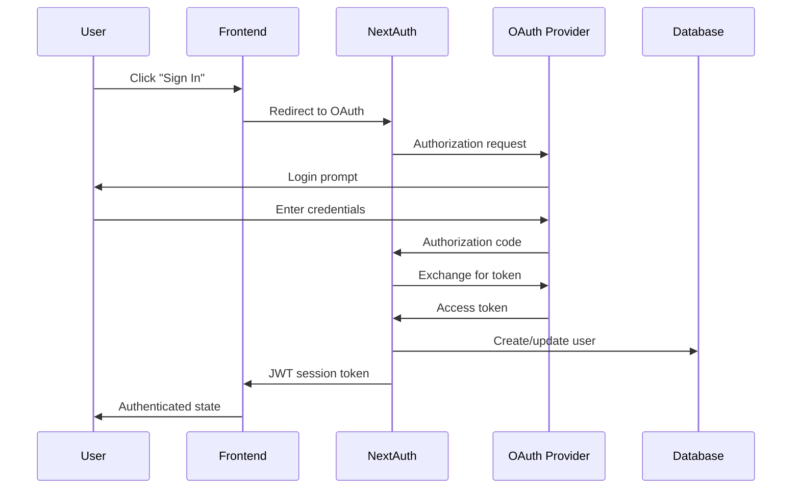

# NEOSHOP ULTRA - Architecture Documentation

## Overview

NEOSHOP ULTRA is a modern, scalable e-commerce platform built with Next.js 14, featuring a microservices-inspired architecture with clear separation of concerns, comprehensive security, and production-ready features.

## Architecture Principles

### 1. Separation of Concerns
- **Frontend**: React components with Next.js App Router
- **Backend**: API routes with Next.js serverless functions
- **Database**: PostgreSQL with Prisma ORM
- **Storage**: Vercel Blob Storage for files
- **Authentication**: NextAuth.js with OAuth providers
- **Payments**: Stripe integration
- **Email**: Resend service integration

### 2. Security-First Design
- Comprehensive input validation and sanitization
- Role-based access control (RBAC)
- Rate limiting and DDoS protection
- CSRF protection and secure headers
- Environment variable encryption
- Secure session management

### 3. Scalability and Performance
- Serverless architecture with auto-scaling
- Database connection pooling
- Redis caching layer
- Image optimization and CDN
- API response caching
- Efficient database queries with proper indexing

### 4. Developer Experience
- TypeScript for type safety
- Comprehensive error handling
- Structured logging and monitoring
- Automated testing and CI/CD
- Clear documentation and code organization

## System Architecture

### High-Level Architecture

```
┌─────────────────┐    ┌─────────────────┐    ┌─────────────────┐
│   Frontend      │    │   Backend       │    │   Database      │
│   (Next.js)     │◄──►│   (API Routes)  │◄──►│   (PostgreSQL)  │
└─────────────────┘    └─────────────────┘    └─────────────────┘
         │                       │                       │
         │                       │                       │
         ▼                       ▼                       ▼
┌─────────────────┐    ┌─────────────────┐    ┌─────────────────┐
│   CDN/Edge      │    │   Redis Cache   │    │   File Storage  │
│   (Vercel)      │    │   (Sessions)    │    │   (Blob)        │
└─────────────────┘    └─────────────────┘    └─────────────────┘
```

### Component Architecture

```
┌─────────────────────────────────────────────────────────────────┐
│                        Presentation Layer                       │
├─────────────────────────────────────────────────────────────────┤
│  Pages          │  Components    │  Hooks        │  Stores      │
│  - App Router   │  - UI/UX       │  - Custom     │  - Zustand   │
│  - SSR/SSG      │  - Forms       │  - Auth       │  - Cart      │
│  - Dynamic      │  - Layouts     │  - API        │  - User      │
└─────────────────────────────────────────────────────────────────┘
                                │
                                ▼
┌─────────────────────────────────────────────────────────────────┐
│                         Business Logic Layer                    │
├─────────────────────────────────────────────────────────────────┤
│  API Routes     │  Services      │  Utilities    │  Validation  │
│  - RESTful      │  - Stripe      │  - Helpers    │  - Zod       │
│  - Middleware   │  - Email       │  - Security   │  - Sanitize  │
│  - Auth         │  - Storage     │  - Logger     │  - Transform │
└─────────────────────────────────────────────────────────────────┘
                                │
                                ▼
┌─────────────────────────────────────────────────────────────────┐
│                          Data Access Layer                      │
├─────────────────────────────────────────────────────────────────┤
│  Database       │  ORM           │  Migrations   │  Seeding     │
│  - PostgreSQL   │  - Prisma      │  - Schema     │  - Test Data │
│  - Indexes      │  - Queries     │  - Updates    │  - Admin     │
│  - Relations    │  - Transactions│  - Rollbacks  │  - Products  │
└─────────────────────────────────────────────────────────────────┘
```

## Frontend Architecture

### Next.js App Router Structure

```
app/
├── (auth)/                    # Auth route group
│   ├── signin/
│   └── signup/
├── (dashboard)/               # Dashboard route group
│   ├── admin/
│   └── profile/
├── api/                       # API routes
│   ├── auth/
│   ├── products/
│   ├── orders/
│   ├── payments/
│   └── admin/
├── cart/
├── checkout/
├── orders/
├── products/
├── payments/
└── globals.css
```

### Component Hierarchy

```
App
├── Providers
│   ├── AuthProvider
│   ├── StripeProvider
│   └── ThemeProvider
├── Layout
│   ├── Header
│   │   ├── Navigation
│   │   ├── UserMenu
│   │   └── CartButton
│   ├── Sidebar (Admin)
│   └── Footer
├── Pages
│   ├── Home
│   ├── Products
│   ├── Cart
│   ├── Checkout
│   ├── Orders
│   └── Admin
└── Modals
    ├── CartSidebar
    ├── AuthModal
    └── PaymentModal
```

### State Management

#### Zustand Stores

```typescript
// Cart Store
interface CartStore {
  items: CartItem[]
  addItem: (product: Product, quantity: number) => void
  removeItem: (productId: string) => void
  updateQuantity: (productId: string, quantity: number) => void
  clearCart: () => void
  getTotalPrice: () => number
}

// User Store
interface UserStore {
  user: User | null
  isAuthenticated: boolean
  login: (credentials: LoginCredentials) => Promise<void>
  logout: () => void
  updateProfile: (data: UserUpdateData) => Promise<void>
}
```

#### Custom Hooks

```typescript
// useAuth Hook
export function useAuth() {
  const { data: session } = useSession()
  const [user, setUser] = useState<User | null>(null)
  
  return {
    user: session?.user,
    isAuthenticated: !!session,
    isLoading: status === 'loading'
  }
}

// useCart Hook
export function useCart() {
  const cartStore = useCartStore()
  
  return {
    items: cartStore.items,
    addItem: cartStore.addItem,
    removeItem: cartStore.removeItem,
    totalPrice: cartStore.getTotalPrice()
  }
}
```

## Backend Architecture

### API Route Structure

```
api/
├── auth/                      # Authentication endpoints
│   ├── [...nextauth]/        # NextAuth.js handler
│   ├── register/             # User registration
│   ├── verify/               # Email verification
│   └── sessions/             # Session management
├── products/                  # Product management
│   ├── route.ts              # GET, POST
│   └── [id]/                 # GET, PUT, DELETE
├── orders/                    # Order management
│   ├── route.ts              # GET, POST
│   └── [id]/                 # GET, PUT
├── payments/                  # Payment processing
│   ├── create-intent/        # Create payment intent
│   ├── confirm/              # Confirm payment
│   ├── cancel/               # Cancel payment
│   ├── refund/               # Process refund
│   └── webhook/              # Stripe webhooks
├── admin/                     # Admin endpoints
│   ├── users/                # User management
│   ├── products/             # Product management
│   ├── orders/               # Order management
│   └── analytics/            # Analytics data
└── upload/                    # File upload
    ├── route.ts              # Generic upload
    ├── image/                # Image upload
    └── delete/               # File deletion
```

### Middleware Stack

```typescript
// Middleware Pipeline
export async function middleware(request: NextRequest) {
  // 1. Security Headers
  const securityResponse = await defaultSecurityMiddleware(request)
  if (securityResponse.status !== 200) return securityResponse

  // 2. CORS
  const corsResponse = corsMiddleware(request)
  if (corsResponse) return corsResponse

  // 3. Rate Limiting
  const rateLimitResponse = rateLimiter.middleware()(request)
  if (rateLimitResponse) return rateLimitResponse

  // 4. API Versioning
  const versionResponse = apiVersionMiddleware(request)
  if (versionResponse) return versionResponse

  // 5. Authentication (for protected routes)
  if (request.nextUrl.pathname.startsWith('/api/admin')) {
    const authResponse = await adminSecurityMiddleware(request)
    if (authResponse.status !== 200) return authResponse
  }

  return NextResponse.next()
}
```

### Service Layer

#### Stripe Service

```typescript
export class StripeService {
  static async createPaymentIntent(amount: number, orderId: string) {
    // Create payment intent with Stripe
  }
  
  static async confirmPaymentIntent(paymentIntentId: string, paymentMethodId: string) {
    // Confirm payment with Stripe
  }
  
  static async processRefund(paymentIntentId: string, amount?: number) {
    // Process refund through Stripe
  }
}
```

#### Email Service

```typescript
export class EmailService {
  static async sendWelcomeEmail(user: User) {
    // Send welcome email via Resend
  }
  
  static async sendOrderConfirmation(order: Order) {
    // Send order confirmation email
  }
  
  static async sendPasswordReset(email: string, token: string) {
    // Send password reset email
  }
}
```

## Database Architecture

### Entity Relationship Diagram

```
User (1) ────── (M) Order
  │                │
  │                │
  │                │
  │                ▼
  │            OrderItem (M) ──── (1) Product
  │                │
  │                │
  │                │
  │                ▼
  │            Payment
  │
  │
  ▼
Review (M) ──── (1) Product

Product (M) ──── (1) Category
  │
  │
  ▼
Inventory

Cart (M) ──── (1) User
  │
  │
  ▼
CartItem (M) ──── (1) Product
```

### Database Schema

#### Core Tables

```sql
-- Users table
CREATE TABLE users (
  id UUID PRIMARY KEY DEFAULT gen_random_uuid(),
  email VARCHAR(255) UNIQUE NOT NULL,
  name VARCHAR(255),
  password VARCHAR(255),
  role user_role DEFAULT 'CUSTOMER',
  is_active BOOLEAN DEFAULT true,
  email_verified BOOLEAN DEFAULT false,
  created_at TIMESTAMP DEFAULT NOW(),
  updated_at TIMESTAMP DEFAULT NOW()
);

-- Products table
CREATE TABLE products (
  id UUID PRIMARY KEY DEFAULT gen_random_uuid(),
  name VARCHAR(255) NOT NULL,
  description TEXT,
  price DECIMAL(10,2) NOT NULL,
  image_url TEXT[],
  category_id UUID REFERENCES categories(id),
  stock INTEGER DEFAULT 0,
  sku VARCHAR(100),
  is_active BOOLEAN DEFAULT true,
  created_at TIMESTAMP DEFAULT NOW(),
  updated_at TIMESTAMP DEFAULT NOW()
);

-- Orders table
CREATE TABLE orders (
  id UUID PRIMARY KEY DEFAULT gen_random_uuid(),
  order_number VARCHAR(50) UNIQUE NOT NULL,
  user_id UUID REFERENCES users(id),
  status order_status DEFAULT 'PENDING',
  payment_status payment_status DEFAULT 'PENDING',
  total_amount DECIMAL(10,2) NOT NULL,
  shipping_address JSONB NOT NULL,
  billing_address JSONB NOT NULL,
  payment_intent_id VARCHAR(255),
  created_at TIMESTAMP DEFAULT NOW(),
  updated_at TIMESTAMP DEFAULT NOW()
);
```

#### Indexes for Performance

```sql
-- User indexes
CREATE INDEX idx_users_email ON users(email);
CREATE INDEX idx_users_role ON users(role);
CREATE INDEX idx_users_active ON users(is_active);

-- Product indexes
CREATE INDEX idx_products_category ON products(category_id);
CREATE INDEX idx_products_active ON products(is_active);
CREATE INDEX idx_products_price ON products(price);
CREATE INDEX idx_products_stock ON products(stock);

-- Order indexes
CREATE INDEX idx_orders_user ON orders(user_id);
CREATE INDEX idx_orders_status ON orders(status);
CREATE INDEX idx_orders_created ON orders(created_at);
CREATE INDEX idx_orders_payment ON orders(payment_intent_id);
```

## Security Architecture

### Authentication Flow



### Authorization Matrix

| Resource | Customer | Admin | Guest |
|----------|----------|-------|-------|
| View Products | ✅ | ✅ | ✅ |
| Add to Cart | ✅ | ✅ | ✅ |
| Create Order | ✅ | ✅ | ❌ |
| View Own Orders | ✅ | ✅ | ❌ |
| Manage Products | ❌ | ✅ | ❌ |
| Manage Orders | ❌ | ✅ | ❌ |
| Manage Users | ❌ | ✅ | ❌ |
| View Analytics | ❌ | ✅ | ❌ |

### Security Middleware Stack

```typescript
// Security Middleware Pipeline
export async function securityMiddleware(request: NextRequest) {
  // 1. Security Headers
  response.headers.set('X-Frame-Options', 'DENY')
  response.headers.set('X-Content-Type-Options', 'nosniff')
  response.headers.set('X-XSS-Protection', '1; mode=block')
  response.headers.set('Strict-Transport-Security', 'max-age=31536000')
  
  // 2. CORS Protection
  const origin = request.headers.get('origin')
  if (!isAllowedOrigin(origin)) {
    return new Response('Forbidden', { status: 403 })
  }
  
  // 3. Rate Limiting
  const clientId = getClientId(request)
  if (await isRateLimited(clientId)) {
    return new Response('Too Many Requests', { status: 429 })
  }
  
  // 4. CSRF Protection
  if (isStateChangingRequest(request)) {
    if (!isValidCSRFToken(request)) {
      return new Response('CSRF Token Mismatch', { status: 403 })
    }
  }
  
  return NextResponse.next()
}
```

## Performance Architecture

### Caching Strategy

#### Multi-Level Caching

```
┌─────────────────┐    ┌─────────────────┐    ┌─────────────────┐
│   Browser       │    │   CDN/Edge      │    │   Application   │
│   Cache         │◄──►│   Cache         │◄──►│   Cache         │
│   - Static      │    │   - Images      │    │   - API         │
│   - API         │    │   - CSS/JS      │    │   - Database    │
│   - Session     │    │   - Fonts       │    │   - Sessions    │
└─────────────────┘    └─────────────────┘    └─────────────────┘
```

#### Cache Invalidation

```typescript
// Cache Invalidation Strategy
export class CacheManager {
  static async invalidateProductCache(productId: string) {
    // Invalidate product cache
    await redis.del(`product:${productId}`)
    await redis.del('products:list')
    await redis.del('products:featured')
  }
  
  static async invalidateUserCache(userId: string) {
    // Invalidate user-related cache
    await redis.del(`user:${userId}`)
    await redis.del(`user:${userId}:orders`)
    await redis.del(`user:${userId}:cart`)
  }
}
```

### Database Optimization

#### Query Optimization

```typescript
// Optimized Product Queries
export class ProductService {
  static async getProductsWithPagination(page: number, limit: number) {
    return await db.product.findMany({
      skip: (page - 1) * limit,
      take: limit,
      where: { isActive: true },
      include: {
        category: true,
        reviews: {
          select: { rating: true },
          take: 5
        }
      },
      orderBy: { createdAt: 'desc' }
    })
  }
  
  static async getProductWithDetails(id: string) {
    return await db.product.findUnique({
      where: { id },
      include: {
        category: true,
        reviews: {
          include: { user: { select: { name: true } } },
          orderBy: { createdAt: 'desc' }
        },
        inventory: true
      }
    })
  }
}
```

#### Connection Pooling

```typescript
// Database Connection Pool
export const db = new PrismaClient({
  datasources: {
    db: {
      url: env.DATABASE_URL
    }
  },
  log: ['query', 'info', 'warn', 'error'],
  // Connection pooling configuration
  __internal: {
    engine: {
      connectTimeout: 60000,
      pool: {
        min: 2,
        max: 10
      }
    }
  }
})
```

## Monitoring Architecture

### Error Tracking

```typescript
// Sentry Integration
import * as Sentry from '@sentry/nextjs'

Sentry.init({
  dsn: env.SENTRY_DSN,
  environment: env.NODE_ENV,
  tracesSampleRate: 1.0,
  beforeSend(event) {
    // Filter sensitive data
    if (event.request?.cookies) {
      delete event.request.cookies
    }
    return event
  }
})
```

### Performance Monitoring

```typescript
// Performance Monitoring
export function trackPerformance(name: string, fn: () => Promise<any>) {
  return async (...args: any[]) => {
    const start = performance.now()
    try {
      const result = await fn(...args)
      const duration = performance.now() - start
      
      // Log performance metrics
      logger.performance(name, { duration, success: true })
      
      return result
    } catch (error) {
      const duration = performance.now() - start
      logger.performance(name, { duration, success: false, error })
      throw error
    }
  }
}
```

### Health Checks

```typescript
// Health Check Endpoints
export async function healthCheck() {
  const checks = await Promise.allSettled([
    checkDatabase(),
    checkRedis(),
    checkStripe(),
    checkResend()
  ])
  
  const status = checks.every(check => check.status === 'fulfilled')
  
  return {
    status: status ? 'healthy' : 'unhealthy',
    timestamp: new Date().toISOString(),
    checks: checks.map((check, index) => ({
      service: ['database', 'redis', 'stripe', 'resend'][index],
      status: check.status,
      error: check.status === 'rejected' ? check.reason : null
    }))
  }
}
```

## Deployment Architecture

### Vercel Deployment

```
┌─────────────────┐    ┌─────────────────┐    ┌─────────────────┐
│   Git Repo      │    │   Vercel        │    │   Production    │
│   - Main        │◄──►│   - Build       │◄──►│   - Edge        │
│   - Staging     │    │   - Deploy      │    │   - Functions   │
│   - Feature     │    │   - Preview     │    │   - CDN         │
└─────────────────┘    └─────────────────┘    └─────────────────┘
```

### Environment Configuration

```typescript
// Environment Configuration
export const env = {
  NODE_ENV: process.env.NODE_ENV as 'development' | 'production' | 'test',
  DATABASE_URL: process.env.DATABASE_URL!,
  NEXTAUTH_SECRET: process.env.NEXTAUTH_SECRET!,
  NEXTAUTH_URL: process.env.NEXTAUTH_URL!,
  STRIPE_SECRET_KEY: process.env.STRIPE_SECRET_KEY!,
  STRIPE_PUBLISHABLE_KEY: process.env.NEXT_PUBLIC_STRIPE_PUBLISHABLE_KEY!,
  REDIS_URL: process.env.REDIS_URL!,
  BLOB_READ_WRITE_TOKEN: process.env.BLOB_READ_WRITE_TOKEN!,
  RESEND_API_KEY: process.env.RESEND_API_KEY!,
  SENTRY_DSN: process.env.SENTRY_DSN!,
  GOOGLE_ANALYTICS_ID: process.env.GOOGLE_ANALYTICS_ID!,
  GOOGLE_TAG_MANAGER_ID: process.env.GOOGLE_TAG_MANAGER_ID!
}
```

## Scalability Considerations

### Horizontal Scaling

- **Stateless Architecture**: All state stored in database or Redis
- **CDN Distribution**: Static assets served from edge locations
- **Database Read Replicas**: Read queries distributed across replicas
- **Microservices Ready**: API routes can be extracted to separate services

### Vertical Scaling

- **Database Optimization**: Proper indexing and query optimization
- **Caching Strategy**: Multi-level caching reduces database load
- **Connection Pooling**: Efficient database connection management
- **Image Optimization**: Compressed and optimized images

### Performance Monitoring

- **Core Web Vitals**: LCP, FID, CLS tracking
- **API Response Times**: Endpoint performance monitoring
- **Database Query Performance**: Slow query identification
- **Error Rates**: Application error tracking and alerting

## Future Architecture Considerations

### Microservices Migration

```
Current Monolith → Future Microservices

┌─────────────────┐    ┌─────────────────┐
│   Next.js App   │    │   API Gateway   │
│   - Frontend    │    │   - Routing     │
│   - Backend     │    │   - Auth        │
│   - Database    │    │   - Rate Limit  │
└─────────────────┘    └─────────────────┘
                              │
                              ▼
┌─────────────────┐    ┌─────────────────┐    ┌─────────────────┐
│   User Service  │    │  Product Service│    │  Order Service  │
│   - Auth        │    │  - Catalog      │    │  - Fulfillment  │
│   - Profile     │    │  - Inventory    │    │  - Shipping     │
└─────────────────┘    └─────────────────┘    └─────────────────┘
```

### Event-Driven Architecture

```typescript
// Event System
export class EventBus {
  static async emit(event: string, data: any) {
    // Emit event to all subscribers
    await redis.publish('events', JSON.stringify({ event, data }))
  }
  
  static async subscribe(event: string, handler: (data: any) => Promise<void>) {
    // Subscribe to specific events
    await redis.subscribe('events', handler)
  }
}

// Event Handlers
EventBus.subscribe('order.created', async (order) => {
  await EmailService.sendOrderConfirmation(order)
  await InventoryService.reserveItems(order.items)
})
```

This architecture provides a solid foundation for a scalable, maintainable, and secure e-commerce platform that can grow with your business needs.


